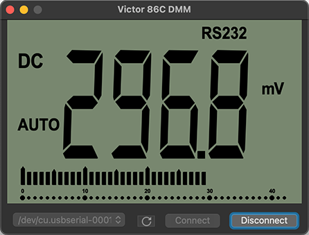
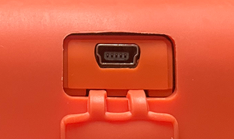

This app will show a replica window in your screen of what a Victor 86C DMM shows
in its screen when connected via USB port.

Only the Victor 86C DMM with the USB Mini B port is supported for now.
May be others using the same USB port work too.

Steps to run:

* Connect a USB A to USB Mini B from your Victor 86C DMM to the PC or Mac.
* Open the app.
* Choose your USB device from the list and click "Connect".
* In your Victor 86C DMM keep pressed the "RS232" button until you see RS232 in the DMM screen.

The refresh rate is limited to 1Hz by what the DMM sends via de USB cable.
